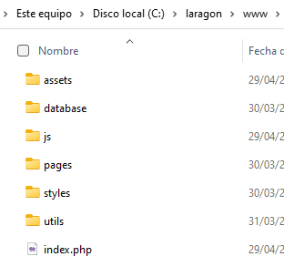

## Como mostrar la página desde tu localhost

#### Debes intalar Laragon: https://laragon.org/download/

```
Una vez instalado Laragon debes iniciarlo y darle al apartado de menu situado en la parte 
superior del programa, después le das a la opción de MYSQL y le das clic a la opción 
'Change password password' y le pones de contraseña 'root'.
```

Ahora vamos a poner la página en la siguiente ruta: 'C:\laragon\www' y colocamos todos los archivos 
dentro de la carpeta.



```
IMPORTANTE: Debes importar la base de datos, en las carpetas de la página web hay una
carpeta con el nombre 'ConfiguraciónDB' debes entrar dentro y estarán los dos
ficheros SQLs para insertarlo en la base de datos.
```

Volvemos ha abrir laragon y le damos a la opción de 'Start all',
para poder ver la página en nuestro navegador debemos escribir la
siguiente URL: 
https://localhost/

### Usuarios de test

```
  Usuario: Fran
  Password: 123456 

  Usuario: Test
  Password: 123456
```