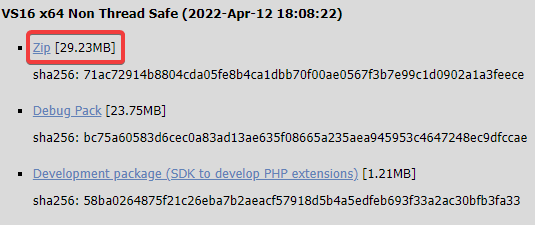

## Como mostrar la página desde tu localhost

#### Debes intalar PHP en tu equipo: https://windows.php.net/download/
<br>
Vamos a la página de PHP y le damos a la opción de ZIP
<br>


Te descargas un archivo .zip, lo descomprimes y lo colocas en algún sitio de tu ordenador, lo recomendable es en el disco local C.

```
IMPORTANTE: En la carpeta que hemos descargado de PHP hay que modificar el 
un archivo llamado php.ini-development. 
Debemos cambiarlo de nombre por php.ini

Abrimos el php.ini por ejemplo con VSCode y debemos descomentar dos 
lineas del fichero. Nos situamos en la linea 763 debe ser una linea 
que contenga "extension_dir = 'ext'" lo que hay que hacer es 
descomentar esa linea, también en la linea 928 debemos descomentar 
una linea que contenga "extension=mysqli" y quitarle el comentario.
```

#### Usaremos MYSQL Workbench para poder usar una base de datos.

```
IMPORTANTE: Debes importar la base de datos, en las carpetas de la página web hay una
carpeta con el nombre 'ConfiguraciónDB' debes entrar dentro y estarán los dos
ficheros SQLs para insertarlo en la base de datos.
```

Para poder ejecutar nuestra página web debemos ir a la carpeta donde se encuentra la página web y abrimos un CMD con la ruta de esta carpeta y dentro el CMD escribimos el siguiente código: 
```
PHP -S localhost:80
```

#### Para poder ver la página en nuestro navegador debemos escribir la siguiente URL: https://localhost/

#### Usuarios de test

```
  Usuario: Fran
  Password: 123456 

  Usuario: Test
  Password: 123456
```